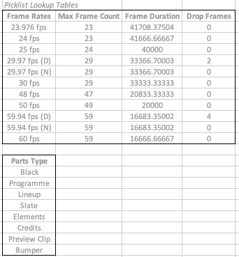
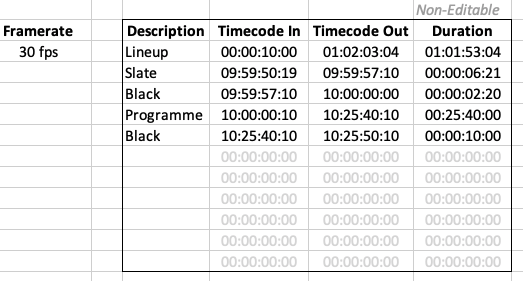

# timecode-spreadsheet
> Programme layout spreadsheet with drop/non-drop frame timecode durations (and no macros)

## Overview

A sample spreadsheet for a programme layout providing rows for each part which consist of:

- part type
- timecode in
- timecode out
- duration

Hidden pick lists provide frame rate selection and part type selection values.

Hidden columns provide time in, time out and duration calculated as both frame count (drop and non-drop) and microsecond values.

#### Key Features 

* Frame rates from 23.976 fps up to 60 fps including 29.97 and 59.94 fps (both drop frame and non-drop frame)
* No macros, so spreadsheets using this can be easily distributed
* Conversion between timecode, frames and duration in microseconds
* Automatic timecode formatting including `;` for drop frame 
* Invalid value highlighting including checks for invalid frame count, invalid seconds, invalid minutes and negative values

#### Key Concepts

Picklists which drive programme frame rate selection and part type selection:

The programme layout table with intermediate value columns hidden:

The programme layout table with intermediate value columns shown:

## Implementation

The following are mostly notes to myself so that I can remember what everything does...
 
#### Conditional Formatting

Formatting for drop frame or non-drop frame is based on whether the selected frame rate includes `D` in the value:

	=ISNUMBER(SEARCH("D",$G$3))

The cell formatting applied is:

* Non-drop frame: `00\:00\:00\:00`
* Drop frame: `00\:00\:00\;00`

Invalid value formatting is applied if:

* text length of the value is not 8 characters
* if the value is less than 0
* if seconds or minutes is greater than 59
* if the frame value is greater than allowed for the selected frame rate

	    =OR(LEN(TEXT(J3, "00000000")) <> 8, VALUE(H3) < 0, VALUE(MID(TEXT(J3, "00000000"), 3, 2)) > 59, VALUE(MID(TEXT(J3, "00000000"), 5, 2)) > 59, VALUE(MID(TEXT(J3, "00000000"), 7, 2)) > LOOKUP($G$3, $B$3:$B$13, $C$3:$C$13))

Entries are greyed out if the row entry is not in use (indicated by description not having a value selected):

	=ISBLANK($I3)

#### Conversion Formulae

The following formula converts from timecode to frame count:

	=(VALUE(LEFT(TEXT(J3, "00000000"), 2)) * 60 * 60 + VALUE(MID(TEXT(J3, "00000000"), 3, 2)) * 60 + VALUE(MID(TEXT(J3, "00000000"), 5, 2))) * (LOOKUP($G$3, $B$3:$B$13, $C$3:$C$13) + 1) + VALUE(MID(TEXT(J3, "00000000"), 7, 2))

The following formula converts from frame count to drop frame count:

	=K3 - ((((VALUE(LEFT(TEXT(J3, "00000000"), 2)) * 60) + VALUE(MID(TEXT(J3, "00000000"), 3, 2))) * LOOKUP($G$3, $B$3:$B$13, $E$3:$E$13)) - (TRUNC(((VALUE(LEFT(TEXT(J3, "00000000"), 2)) * 60) + VALUE(MID(TEXT(J3, "00000000"), 3, 2))) / 10) * LOOKUP($G$3, $B$3:$B$13, $E$3:$E$13)))

The following formula converts from drop frame count to microseconds:

	=L3 * LOOKUP($G$3, $B$3:$B$13, $D$3:$D$13)

The following formula converts from microseconds to timecode:

	=INT(TEXT(TRUNC(R3 / (60 * 60 * (LOOKUP($G$3, $B$3:$B$13, $C$3:$C$13) + 1))), "00") & TEXT(TRUNC(MOD(R3, (60 * 60 * (LOOKUP($G$3, $B$3:$B$13, $C$3:$C$13) + 1))) / (60 * (LOOKUP($G$3, $B$3:$B$13, $C$3:$C$13) + 1))), "00") & TEXT(TRUNC(MOD(MOD(R3, (60 * 60 * (LOOKUP($G$3, $B$3:$B$13, $C$3:$C$13) + 1))), (60 * (LOOKUP($G$3, $B$3:$B$13, $C$3:$C$13) + 1))) / (LOOKUP($G$3, $B$3:$B$13, $C$3:$C$13) + 1)), "00") & TEXT(MOD(MOD(MOD(R3, (60 * 60 * (LOOKUP($G$3, $B$3:$B$13, $C$3:$C$13) + 1))), (60 * (LOOKUP($G$3, $B$3:$B$13, $C$3:$C$13) + 1))), (LOOKUP($G$3, $B$3:$B$13, $C$3:$C$13) + 1)), "00"))

## License

MIT © Vectronic

